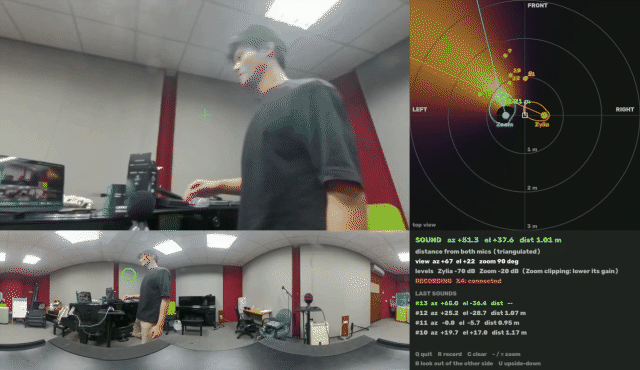

# 🎥 INSTA360: live sound tracker

Real-time version of the MATLAB pipeline in [`../matlab`](../matlab). Two
spherical microphone arrays listen continuously; every ~0.1 s the program works
out **where the sound is (azimuth, elevation, distance)** and turns a virtual
camera, cut out of an Insta360 X4's 360° video, to face it.

<p align="center">
  
</p>

## Contents

- [Requirements](#requirements)
- [Install](#install)
- [Connect the hardware](#connect-the-hardware)
- [Run](#run)
- [The window](#the-window)
- [Calibrate](#calibrate-once-per-rig-build)
- [Settings](#settings-rig_configpy)
- [Output files](#output-files)
- [Troubleshooting](#troubleshooting)
- [How it works](#how-it-works)
- [Validation](#validation)
- [Files](#files)

## Requirements

| | |
|---|---|
| **Computer** | macOS (uses CoreAudio for the mics and AVFoundation for the camera) |
| **Python** | 3.9 or newer |
| **Mic 1** | Zylia ZM-1: 19 raw capsule channels over USB |
| **Mic 2** | Zoom H3-VR in USB audio-interface mode: 4-ch AmbiX. Optional; without it you get direction only |
| **Camera** | Insta360 X4 in USB webcam mode. Optional; without it you get the radar only |

## Install

```bash
git clone https://github.com/Terbz98/Acoustic_Source_Localization.git
cd Acoustic_Source_Localization/INSTA360
python3 -m venv .venv
.venv/bin/python -m pip install -r requirements.txt
```

The scripts always run on this `.venv`, even if you start them with a
different Python (for example VS Code's ▶ Run button).

## Connect the hardware

| Device | How |
|---|---|
| **Zylia ZM-1** | Plug in. On macOS you must approve its driver once: *System Settings → General → Login Items & Extensions → Driver Extensions → ZYLIA ZM-1 Driver → on*. It then appears as a 20-input device (19 capsules + 1 unused). |
| **Zoom H3-VR** | *Menu → USB → Audio I/F → **4ch Ambisonics***, then *Menu → Ambisonic Mode → **AmbiX***. Keep the input gain moderate: clipped frames are discarded. |
| **Insta360 X4** | Plug in USB-C and pick **Webcam** in the USB-mode prompt on the camera's screen. It then offers a 2880 × 1440 panorama. To stop it sleeping: swipe down on its screen → ⚙ → *Auto Power Off → Never*. |

**Rig:** stand the two mics side by side, **1 m apart (tape-measure it)**,
both facing the same way. The camera can go anywhere; enter its position in
[`rig_config.py`](rig_config.py).

The first time you run it, macOS asks to let **Terminal** (or VS Code) use the
**Microphone** and the **Camera**. Allow both.

## Run

Double-click **`START_TRACKER.command`**, or:

```bash
.venv/bin/python live_tracker.py
```

Clap or talk near the mics. The view turns toward the sound, and each
separate sound gets one line:

```
Listening. Every sound (clap, word, knock...) gets one line below:

[22:30:52] SOUND #2   az  -20.3   el  +0.7   dist 1.44 m   (1.50 s)
[22:30:54] SOUND #3   az  -18.1   el  +0.9   dist 1.45 m   (1.16 s)
```

**az** = degrees left (+) / right (−) of straight ahead · **el** = degrees up
(+) / down (−) · **dist** = metres from the midpoint of the two mics.

### Options

| Command | Does |
|---|---|
| `live_tracker.py` | mics + camera (default) |
| `live_tracker.py --no-camera` | radar and numbers only |
| `live_tracker.py --zylia-only` | ignore the Zoom: direction only, no distance |
| `live_tracker.py --record` | also record every mic (WAV) and a video of the window with sound to `recordings/` |
| `live_tracker.py --headless` | no window, terminal output only |
| `live_tracker.py --udp 127.0.0.1:9870` | also send every estimate as JSON over UDP |
| `live_tracker.py --replay ZYLIA.wav ZOOM.wav` | run recordings through the live pipeline |
| `analyze_recording.py [recordings/live_<date>_<time>] [--sound N]` | the three MATLAB `main_2mic.m` figures (per-frame estimates, direction scores, top-view position map) for a recording; newest recording if none is named |
| `live_tracker.py --calibrate X Y` | measure the mic yaw ([below](#calibrate-once-per-rig-build)) |
| `live_tracker.py --list-devices` | list audio devices |
| `camera_view.py --list` | list cameras and their formats |
| `camera_view.py --test` | X4 only: drag with the mouse to look around |

All options: `live_tracker.py --help`.

## The window

| Area | Shows |
|---|---|
| **Top left** | the X4 view, turned toward the sound |
| **Top right** | radar (top view, front at the top): both mics with their live direction maps, the yellow region where they agree, the sound and its distance, orange dots for recent sounds |
| **Bottom left** | the full 360° panorama. Green circle = where the view looks, red × = latest sound |
| **Bottom right** | current sound, view, mic levels, camera status, the last 4 sounds |

| Key | Action |
|---|---|
| `Q` | quit |
| `R` | start / stop recording (every mic + a video of the window with sound) |
| `B` | look out of the other side of the X4 |
| `U` | upside-down (X4 mounted upside down) |
| `-` `=` | zoom out / in |
| `C` | clear the direction maps |

The camera never physically moves: it always sends its whole 360° picture, and
the program chooses which part to show. The window is drawn at full Retina
resolution.

## Calibrate (once per rig build)

**1. Mic yaw.** Distance depends on this. Two mics "facing the same way" are
never exactly parallel, and every degree of twist distorts the range. Stand on
the rig's centre line at a tape-measured distance (e.g. 1.5 m straight ahead)
and talk or clap for 15 s:

```bash
.venv/bin/python live_tracker.py --calibrate 1.5 0
```

Paste the printed `YAW_ZYLIA_DEG` / `YAW_ZOOM_DEG` into `rig_config.py`. A
relative yaw of +4 to +5.5° is normal for this pair; much more means a mic is
turned. Check the result at a *different* measured spot before you trust a
distance.

**2. Camera direction.** Clap in front of the rig. If the view shows the back,
press `B`. If it's off by a fixed angle, set `CAMERA_YAW_DEG`. If it turns the
wrong way when you move, set `CAMERA_MIRROR = True`.

## Settings (`rig_config.py`)

| Setting | Default | Meaning |
|---|---|---|
| `LAYOUT` | `'LR'` | how the mics stand: side by side (`LR`), Zylia in front (`FB`), Zoom in front (`BF`) |
| `BASELINE_M` | `1.00` | distance between the mics. **Tape-measure it**; the range scales with it |
| `YAW_ZYLIA_DEG`, `YAW_ZOOM_DEG` | `0`, `4.75` | each mic's rotation, from `--calibrate` |
| `ZOOM_FORMAT` | `'ambix'` | must match the H3-VR's Ambisonic Mode (`ambix` / `fuma`) |
| `CAMERA_POS_M` | `(0, 0, 0)` | camera position, metres: x forward, y left, z up, origin between the mics |
| `CAMERA_YAW_DEG` | `0` | which way the panorama's centre faces |
| `CAMERA_MIRROR`, `CAMERA_UPSIDE_DOWN` | `False` | camera orientation fixes |
| `TAU_S` | `0.6` | how long the direction maps remember (shorter = faster, jumpier) |
| `MIN_EVIDENCE` | `3.0` | how much sound is needed before the view moves (raise if stray noises move it) |
| `SMOOTH_S` | `0.25` | camera turn smoothing |
| `FALLBACK_DISTANCE_M` | `2.0` | distance assumed when only the direction is known |

## Output files

| File | Contents |
|---|---|
| `logs/sounds_<date>_<time>.csv` | one row per sound: `sound, clock, time_s, duration_s, azimuth_deg, elevation_deg, distance_m, how, zylia_az_deg, zylia_el_deg, zoom_az_deg, frames, evidence`. Opens in Excel |
| `recordings/live_<date>_<time>_zylia19.wav` | Zylia, 19 raw channels, 48 kHz / 24-bit (with `--record` or `R`) |
| `recordings/live_<date>_<time>_zoom_ambix.wav` | Zoom, 4-ch AmbiX, 48 kHz / 24-bit |
| `recordings/live_<date>_<time>_x4_stereo.wav` | the X4's own stereo microphone (when the X4 is connected) |
| `recordings/live_<date>_<time>_video.mp4` | video of the window with the X4's sound, made when recording stops (takes up to a minute; the window may freeze meanwhile) |
| `recordings/live_<date>_<time>_sync.json` | start time of every file, to line up the CSV's `time_s`, the WAVs and the video |
| `logs/sounds_<date>_<time>/sound_NNN_az…_el…_<dist>_{360,view,window}.jpg` | three pictures per sound: the X4's 360° frame at that moment, the view aimed exactly at the sound, and the whole window |
| `logs/x4_frame.jpg` | one camera frame, to check the camera orientation |

To analyse a recording in MATLAB: convert the `_zylia19.wav` with **ZYLIA
Ambisonics Converter** to `_(ACN-SN3D-3).wav`, then use it with the Zoom file
in [`../matlab/main_2mic.m`](../matlab/main_2mic.m).

## Troubleshooting

| Symptom | Fix |
|---|---|
| Zylia not listed / "No input device matching Zylia" | Approve the driver (see [Connect the hardware](#connect-the-hardware)); check with `systemextensionsctl list` that it reads `activated enabled` |
| "H3-VR offers only 2 input channels" | The H3-VR is in *Stereo* USB mode. Choose **4ch Ambisonics** |
| Camera panel says "X4 not found" | X4 is off, asleep, or not in Webcam mode. It reconnects by itself once it's back. Set *Auto Power Off → Never* |
| Camera panel says "no camera permission" | Run from **Terminal** or **VS Code** (not from an app without camera access), and allow Camera in *System Settings → Privacy & Security → Camera* |
| Only "direction only", never a distance | The source is near the line through both mics, or further than ~3× the baseline, or the Zoom isn't hearing it. Stand in front of the pair |
| "Zoom clipping: lower its gain" | Turn the H3-VR input gain down |
| View jumps to random noises | Raise `MIN_EVIDENCE` in `rig_config.py` |
| `ModuleNotFoundError` | Create the `.venv` ([Install](#install)); the scripts switch to it automatically |

## How it works

1. **Per mic, every 21 ms frame (10.7 ms hop):** FFT, then *steered-response power* over an az × el grid:
   - **Zylia:** its 19 raw capsules steered with the exact rigid-sphere model (radius 0.056 m, calibrated from recordings), 1–8 kHz.
   - **Zoom:** AmbiX → ACN/N3D, steered with 1st-order spherical harmonics, 0.8–4 kHz.

   Frames are kept only if they are ≥ 10 dB above the room's noise floor and not clipped. Each map is normalised and weighted by how sharp its peak is, then added into a decaying average (`TAU_S`).
2. **Distance:** each mic's azimuth map is laid over a grid of room positions and the two are multiplied. The peak is the source. Guards reject geometry with no range information (source on the axis through the mics, r > 3× baseline).
3. **Per sound:** the stream is cut into separate sounds (a sound ends after 0.25 s of quiet), and each is localised from its own frames.
4. **Camera:** a perspective view is rendered from the equirectangular panorama in the direction of the source *as seen from the camera's position*, then smoothed.

## Validation

`validate_offline.py` runs the recorded takes through the same estimator
(recordings are read from `../data/` if it exists, otherwise from the repo
root). Replayed through the live tracker, source ≈ 1.5 m away:

| Take (truth) | Live az | Live el | Live dist | MATLAB dist |
|---|---|---|---|---|
| back clap (180°, 1.50 m) | −179.1° | +0.0° | 1.58 m | 1.56 m |
| in front of Zylia (−18.4°, 1.58 m) | −17.5° | +0.3° | 1.52 m | 1.52 m |
| in front of Zoom (+18.4°, 1.58 m) | +15.6° | −0.9° | 1.66 m | 1.62 m |
| centre, raised (0°, el ≈ +17°, 1.57 m) | −0.9° | +21.7° | 1.76 m | 1.66 m |

`validate_offline.py --sh` also runs the converted ambisonic files through a
direct port of `run_doa.m` and reproduces the MATLAB numbers (e.g. the raised
take: az −0.7°, el +15.6°, identical to MATLAB).

## Files

| File | Purpose |
|---|---|
| `START_TRACKER.command` | double-click launcher |
| `live_tracker.py` | main program: audio input, tracking, per-sound log, window, recording, calibration, replay |
| `rig_config.py` | every value you measure at the rig |
| `doa_core.py` | one array: steering vectors, SRP maps, gates, accumulation (port of `run_doa.m`, `az_power_map.m`, `build_steering_matrix.m`) |
| `fusion.py` | two arrays → position (port of `triangulate.m`) |
| `camera_view.py` | X4 capture (AVFoundation, auto-reconnect) and 360° reframing |
| `analyze_recording.py` | MATLAB-style figures for a recording, saved to `logs/figures/` |
| `validate_offline.py` | scoreboard against the recorded takes |
| `use_project_python.py` | makes every script run on `.venv` |
