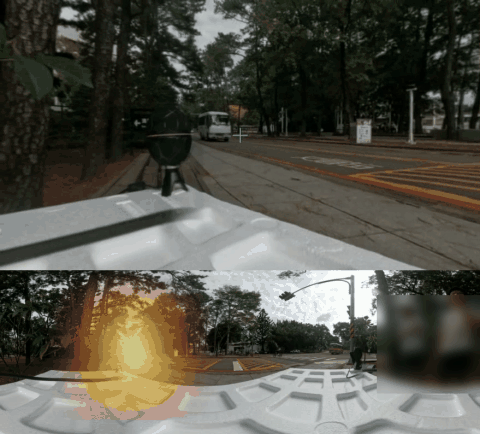
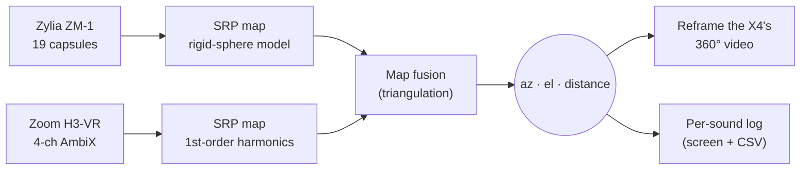

<div align="center">

#  Acoustic Source Localization

**Find where a sound is coming from (direction *and* distance) with two spherical microphone arrays, and point a 360° camera at it in real time.**


<sub>Live, in a sound-proof room: the camera view turns to whoever is talking.<br>
Top left: the view cut out of the X4's 360° picture. Top right: the two mics' directions crossing at the sound. Bottom: the whole room and one line per sound.</sub>

<br><br>



<sub>Live, outdoors by a road: the view follows a minibus as it drives past (mics 1.6 m apart, azimuth 0–360°).<br>
Same layout as above; the glow on the 360° strip is where the sound comes from (one bystander blurred).</sub>

</div>

---

## ✨ Highlights

- 🧭 **Direction within a few degrees** (under 3° on most takes, 6.2° worst), with elevation from the 3rd-order Zylia array.
- 📏 **Distance within 3–6% of a tape measure** by triangulating two arrays 1 m apart. A single array can't measure distance at all ([here's why](#-key-findings)).
- 🎥 **Live mode:** a Zylia ZM-1 and a Zoom H3-VR stream into Python, and an Insta360 X4's 360° video turns to face whoever is talking or clapping.
- 🎯 **Tested live:** in a sound-proof room the view lands about 1° from a talker's mouth, and a voice 1.3–1.8 m away is placed within about 0.15 m ([details](#live-test-in-a-sound-proof-room)).
- 📝 **Every sound logged:** each clap or word gets az / el / distance on screen, in the terminal, and in a CSV file.
- ✅ **Validated:** the Python port reproduces the MATLAB results on the same recordings.

## 📑 Contents

- [Quick start: live tracker](#-quick-start-live-tracker)
- [Hardware](#-hardware)
- [How it works](#-how-it-works)
- [Results](#-results)
- [Repository layout](#-repository-layout)
- [Data](#-data)
- [Offline analysis in MATLAB](#-offline-analysis-in-matlab)
- [Recording protocol](#-recording-protocol)
- [Key findings](#-key-findings)
- [Limitations](#-limitations)

## 🚀 Quick start: live tracker

> Full guide, settings and troubleshooting: [`INSTA360/README.md`](INSTA360/README.md)

**1. Set up once:**

```bash
git clone https://github.com/Terbz98/Acoustic_Source_Localization.git
cd Acoustic_Source_Localization/INSTA360
python3 -m venv .venv && .venv/bin/python -m pip install -r requirements.txt
```

**2. Connect the hardware:**

| Device | Setting |
|---|---|
| Zylia ZM-1 | Plug in. On macOS, approve the driver: *System Settings → General → Login Items & Extensions → Driver Extensions → ZYLIA ZM-1 Driver* |
| Zoom H3-VR | *Menu → USB → Audio I/F → 4ch Ambisonics*, then *Ambisonic Mode → AmbiX* |
| Insta360 X4 | Plug in USB-C and choose **Webcam** on the camera's screen. Set *Auto Power Off → Never* |

**3. Run** (double-click `START_TRACKER.command`, or):

```bash
.venv/bin/python live_tracker.py
```

Clap or talk near the mics. The view turns toward you, and each sound gets its own line:

```
[22:30:52] SOUND #2   az  -20.3   el  +0.7   dist 1.44 m   (1.50 s)
[22:30:54] SOUND #3   az  -18.1   el  +0.9   dist 1.45 m   (1.16 s)
```

| Key | Action |
|---|---|
| `Q` | quit |
| `R` | start / stop recording both mics to WAV |
| `B` | look out of the other side of the X4 |
| `U` | upside-down (X4 mounted upside down) |
| `-` `=` | zoom out / in |
| `C` | clear the maps |

Rig measurements (baseline, mic yaw, camera position) go in [`INSTA360/rig_config.py`](INSTA360/rig_config.py).

## 🎛 Hardware

| | Array | Channels | Used for |
|---|---|---|---|
| **Zylia ZM-1** | 3rd-order spherical, 19 capsules on a 5.6 cm rigid sphere | 19 raw (live) / 16 ACN-SN3D (converted) | azimuth, elevation, one ray of the triangulation |
| **Zoom H3-VR** | 1st-order ambisonic | 4 AmbiX | azimuth, the second ray of the triangulation |
| **Insta360 X4** | 360° camera, USB webcam mode | 2880 × 1440 panorama @ 30 fps | the view that follows the sound |

The two mics stand side by side, **1 m apart, both facing the same way**. The camera can go anywhere; you enter its position in the config.

## 🔬 How it works



1. **Direction, per mic.** Every ~10 ms frame, a *steered-response power* (SRP) map is computed over all directions: how much sound arrives from each one. The Zylia uses the exact rigid-sphere model of its 19 capsules, and the Zoom uses 1st-order spherical harmonics. Quiet, clipped and reverberant frames are gated out or down-weighted.
2. **Distance, from two viewpoints.** Each mic's whole azimuth map, not just its peak, is laid over a grid of candidate positions in the room, and the two are multiplied. The peak of the product is the source. A slightly-off frame widens the ridge instead of moving the answer.
3. **Camera.** The X4 can't turn, and doesn't need to: it already sees 360°. The program cuts a normal perspective view out of the panorama, centred on the sound, like Insta360's "reframe" but live.

## 📊 Results

Recorded takes with a tape-measured truth, source ≈ 1.5 m away. "Live" means the recording was replayed through the real-time Python tracker; the value is the median of its ~10 Hz updates.

| Take | Truth (az, dist) | MATLAB az error | MATLAB dist | Live az error | Live dist |
|---|---|---|---|---|---|
| back clap | 180°, 1.50 m | +0.7° | **1.56 m** (+4%) | +0.9° | **1.58 m** |
| in front of Zylia | −18.4°, 1.58 m | −0.7° | **1.52 m** (−4%) | +0.9° | **1.52 m** |
| in front of Zoom | +18.4°, 1.58 m | −2.7° | **1.62 m** (+3%) | −2.8° | **1.66 m** |
| centre, raised ~17° | 0°, 1.57 m | −0.7° | **1.66 m** (+6%) | −0.9° | **1.76 m** |

- **Azimuth is inside 6.2° on every take**, including the ones where distance failed.
- **Elevation** reads +15.6° against about +16–17° measured three independent ways (Zylia only; see limitations).
- Takes with an **unmeasured rig rotation** give +60 to +109% distance error with the same method. That's why the recording protocol below exists.

### Live test in a sound-proof room

28 September 2026: 3 min 15 s of talking, clapping, walking behind the rig and a phone playing bird song, 132 sounds located live. The rig was set up as above (mics 1 m apart, X4 in the middle). The truth here comes from the X4 pictures the tracker saves for every sound: where the mouth or phone is in the picture (direction), and the person's height and feet in the 360° frame (distance). No tape measure, so read these as good estimates.

| Check | Result |
|---|---|
| Talking: view centre vs. the mouth | typically 1°, all 8 checks within 4° |
| Phone held still | typically 5°, 6 of 7 within 6° (one 18° miss) |
| Phone swept around | typically 9° (the view trails a moving source) |
| Distance of a voice 1.3–1.8 m away | typically 0.15 m off (6 checks, from 0.3 m short to 0.6 m far) |
| Stomps and steps on the floor | direction right, distance 0.2–1 m too far (5 checks) |

## 📁 Repository layout

```
Acoustic_Source_Localization/
├── INSTA360/          🎥 live tracker (Python)          → INSTA360/README.md
│   ├── START_TRACKER.command    double-click to run
│   ├── live_tracker.py          main program
│   ├── rig_config.py            your rig's measurements
│   └── ...                      doa_core.py, fusion.py, camera_view.py
│
├── matlab/            🧮 offline analysis (MATLAB)       → matlab/README.md
│   ├── main_2mic.m              start here: two recordings → az, el, distance
│   ├── test_all_takes.m         regression scoreboard over every take
│   ├── run_doa.m, triangulate.m, ...   the building blocks
│   └── investigations/          one-off studies behind the method
│
├── tools/             usb-speed-check.ps1 (Windows: check the Zylia's USB link)
├── docs/              images for the READMEs
└── data/              your recordings go here (not in git)
```

| I want to… | Go to |
|---|---|
| track sounds live with the mics and the 360° camera | [`INSTA360/README.md`](INSTA360/README.md) |
| analyse recordings, reproduce the results | [`matlab/README.md`](matlab/README.md) |
| understand why the method is built this way | [Key findings](#-key-findings) below |

## 🎧 Data

The recordings (~4.6 GB of WAV) aren't in the repository. Put your own in
**`data/`**. Both the MATLAB scripts and the Python validation look there, and
in the repo root.

- **Zylia ZM-1:** convert with *ZYLIA Ambisonics Converter* to `…_(ACN-SN3D-3).wav` (16-ch ACN/SN3D, 3rd order) for MATLAB. The live tracker and `--record` use the raw 19-channel file.
- **Zoom H3-VR:** its own 4-ch AmbiX WAV, as recorded.

## 🧮 Offline analysis in MATLAB

> Full guide: [`matlab/README.md`](matlab/README.md)

1. Put the recordings in `data/`.
2. Open **`matlab/main_2mic.m`**, choose a take in section 1, press **Run**.
3. It prints az / el / distance with a trust verdict, and draws the per-frame estimates, the polar power maps and the fused position map.

After changing any code, run `matlab/test_all_takes.m`: it re-runs every take and prints one scoreboard. Needs base MATLAB plus the Signal Processing Toolbox.

## 📋 Recording protocol

Every rule exists because something went wrong without it.

1. **Tape-measure the baseline.** Distance scales linearly with it.
2. **Aim both mics the same way, and measure the leftover rotation** (`live_tracker.py --calibrate 1.5 0`, or `check_mic_yaw.m` on a front + back take). It's the dominant error term.
3. **Never rebuild the rig mid-session without re-measuring.** The rotation doesn't survive a teardown.
4. **Keep the source in front of the pair**, with range under about 3× the baseline. Grow the baseline for longer range.
5. **Watch the H3-VR's input gain.** It clipped on every clap.
6. **Mark which mic is where** on the floor. Swapped layouts can't be told apart afterwards.

## 💡 Key findings

<details>
<summary><b>One array cannot measure distance.</b> Nine methods tried, nine failures.</summary>

<br>

At 1.5 m, the only single-array cue for range is the curvature of the wavefront. Across an 11 cm sphere that's about **0.5 mm** of extra path. Every curvature-based method returned the edge of its search grid: 3.00 m on every take, and 10.0 m when the grid was widened to 10 m. A quiet source nearby and a loud one far away produce nearly the same signal at one microphone. Breaking that tie needs an external reference, and **a second array at a known baseline** is the one that works.
</details>

<details>
<summary><b>The relative rotation between the arrays is the dominant error.</b></summary>

<br>

The distance information *is* the angle the two arrays disagree by: 36.9° at 1.5 m on a 1 m baseline. An unmeasured twist eats straight into it. A source at 1.50 m reads 1.75 m through a 5° twist, 2.09 m through 10°, and 2.59 m through 15°. Takes where the rotation was measured: −4, +3, +6, +4%. Where it wasn't: +60, +85, +109%. The Zoom also carries a standing offset of about +4.75° that no aiming removes.
</details>

<details>
<summary><b>Frequency-dependent order fixed the 3rd-order direction estimates.</b></summary>

<br>

A spherical array only carries usable order-*n* information above `f_n = n·c/(2πa)`. The original 800–4000 Hz band sat below the order-2 and order-3 cut-ons, which left 11 of 16 channels as pure noise. Each frequency bin now uses only the orders it can physically support.
</details>

<details>
<summary><b>The Zylia's effective radius is 5.6 cm, not 4.9 cm.</b></summary>

<br>

GCC-PHAT arrival delays across all 19 capsules match the rigid-sphere model at **r = 0.056 m with 0.99 correlation**. The 0.049 m in the SAF preset predicts delays 13–15% short. The correction improved azimuth RMSE on every take.
</details>

<details>
<summary><b>The floor reflection can't replace the second array</b> (at normal mic heights).</summary>

<br>

The floor echo is strong (bare hardwood, ~96% pressure), but the **ceiling** echo arrives only 0.25 ms after it. The two blur together into a blend with no fixed direction. Dropping the mic to 0.35 m separates them by 4 ms.
</details>

## 🚧 Limitations

- **Blind axis:** a source on the line through both mics gives both the same bearing at every range, so distance isn't available there. The tracker then falls back to direction only and says so.
- **Range:** trustworthy up to about 3× the baseline (≈ 3 m with the mics 1 m apart).
- **Elevation comes from the Zylia only.** The H3-VR's 1st-order vertical beam is too broad to beat the room.
- **An unmeasured twist between the arrays is invisible** to every check. The results look self-consistent and are wrong. Measure it.
- The live tracker is **macOS-only** for now (CoreAudio devices + AVFoundation camera capture).

---

<div align="center">
<sub>Undergraduate research project · MATLAB + Python · spherical microphone arrays</sub>
</div>
